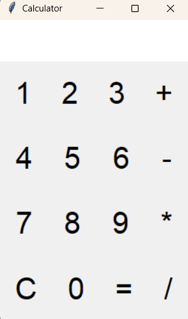

# 🧮 Python GUI Calculator (Tkinter)

A beginner-friendly **GUI Calculator Application** built using **Python and Tkinter**, demonstrating core programming concepts, event handling, and exception management.  
This project was developed as part of academic learning and practical skill building.

---

## 📌 Project Highlights

- Clean and responsive GUI using Tkinter
- Implements basic arithmetic operations
- Real-time input and output display
- Robust error handling for invalid inputs
- Beginner-friendly and well-structured code

---

## ⚙️ Features

- Arithmetic operations:
  - Addition (+)
  - Subtraction (−)
  - Multiplication (×)
  - Division (÷)
- Clear (C) button to reset calculations
- Handles runtime errors gracefully:
  - Division by zero
  - Invalid expressions

---

## 🛠️ Tech Stack

- **Language:** Python 3
- **GUI Library:** Tkinter
- **Paradigm:** Event-driven programming
- **Platform:** Windows, Linux, macOS

---

## 📂 Project Structure
calculator-tkinter/
├── calculator.py
├── README.md
└── calculator-preview.png

---

## ▶️ How to Run the Project
1. Verify Python installation:
pyton --version

2. Clone the repository:
git clone https://github.com/sizzle-del/tkinter-calculator.git

3. Navigate to the project directory:
cd tkinter-calculator

4. Run the application:

---

## 🖥️ Application Preview

---

## 🧠 Concepts Demonstrated

- GUI application development using Tkinter
- Use of `StringVar` for dynamic UI updates
- Button event handling and callbacks
- Exception handling using `try-except`
- Input validation and error management
- Basic expression evaluation logic

---

## 🚀 Scope for Enhancement

- Implement decimal point support
- Add keyboard input functionality
- Improve UI/UX styling
- Replace `eval()` with a secure expression parser
- Extend to a scientific calculator

---

## 👨‍💻 Author

**Akshat Sharma**  
BCA Student (2nd Year)  
Python | Tkinter | GUI Development  

---

## 📄 License

This project is developed for educational and internship portfolio purposes.

